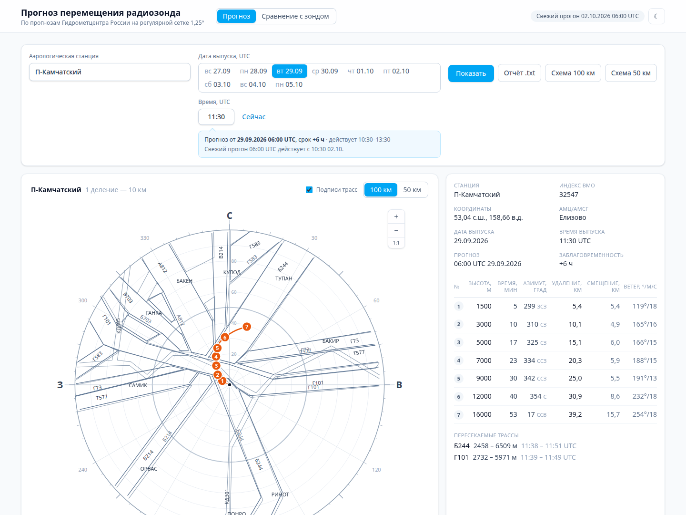
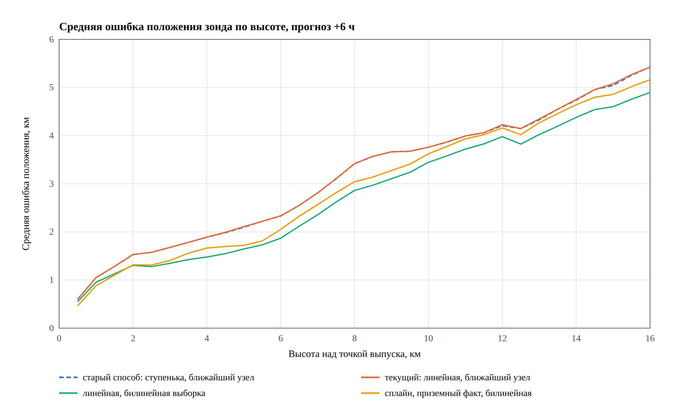
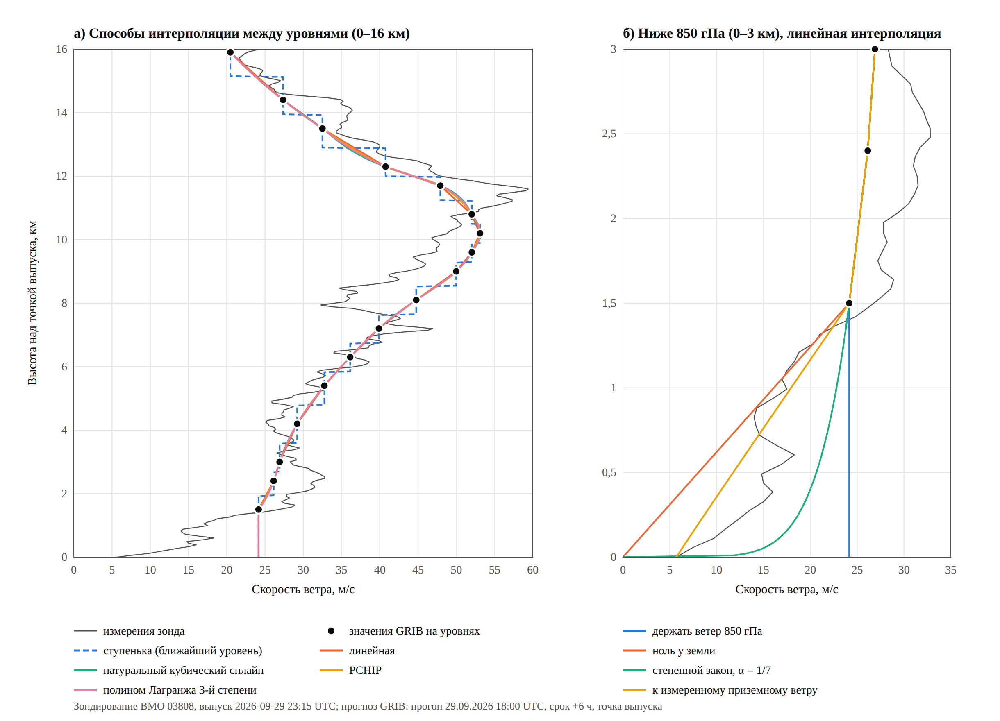
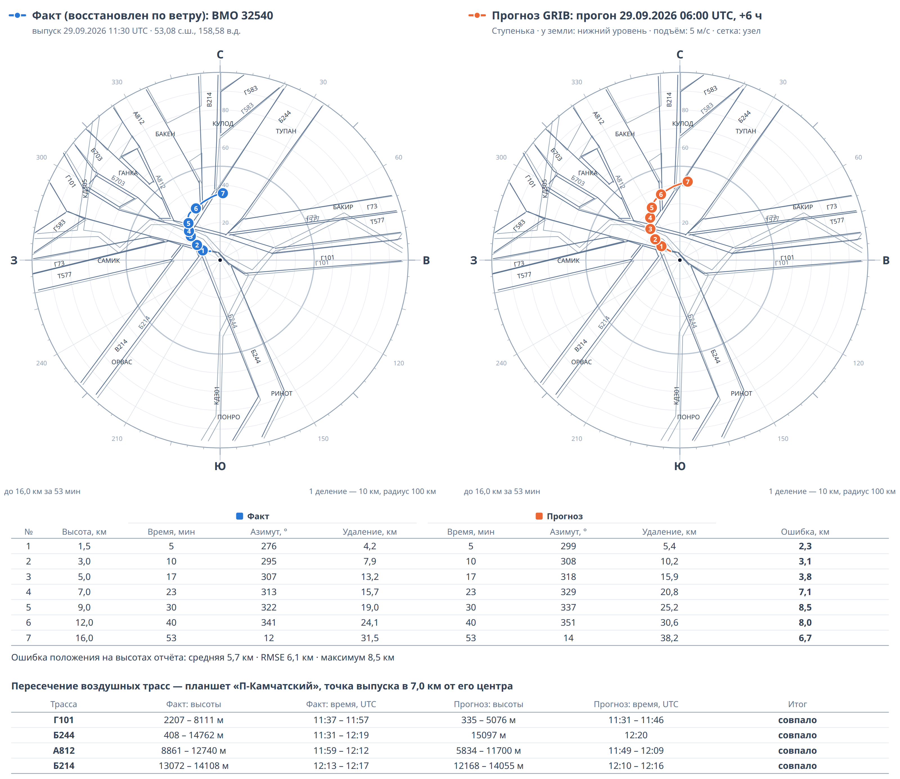

**УДК** [уточнить по таблицам УДК; вариант: 551.508.822 : 004.94]

**Научная специальность:** 2.3.3. Автоматизация и управление технологическими процессами и производствами

# АВТОМАТИЗАЦИЯ ПРОГНОЗИРОВАНИЯ ТРАЕКТОРИИ РАДИОЗОНДА ПО ДАННЫМ ГЛОБАЛЬНОЙ ЧИСЛЕННОЙ МОДЕЛИ И ЕЁ ПРОВЕРКА ПО РЕАЛЬНЫМ ЗОНДИРОВАНИЯМ

# AUTOMATION OF RADIOSONDE TRAJECTORY FORECASTING FROM GLOBAL NUMERICAL WEATHER PREDICTION DATA AND ITS VERIFICATION AGAINST REAL SOUNDINGS

**[ФИО автора]**
[учёная степень, должность], [организация], [город]
[e-mail]

**[Author's full name]**
[degree, position], [organization], [city]
[e-mail]

**Аннотация.** Рассматривается автоматизация прогноза перемещения радиозонда на аэрологической станции. Раньше такой прогноз метеоролог составлял вручную по прогностическому ветру на изобарических уровнях, считая ветер в каждом слое постоянным. Предложено математическое и программное обеспечение, которое по данным глобальной модели Гидрометцентра России (сетка 1,25°, 17 уровней) рассчитывает подъём зонда, его положение на высотах бланка и пересекаемые воздушные трассы с высотами и временем пересечения. Сравниваются варианты расчёта: способы интерполяции ветра по высоте (ступенчатая, линейная, сплайны, полином), учёт ветра у земли, скорость подъёма и выборка поля по сетке. Прогнозы с заблаговременностью 6 ч проверены по 28 реальным зондированиям пяти станций. При среднем сносе 47,5 км до высоты 16 км ошибка положения на этой высоте составила 4,9–5,4 км. Сильнее всего на точность влияет выборка поля по сетке, а способы интерполяции по высоте различаются менее чем на 0,1 км. По двум станциям с планшетами воздушных трасс прогноз выявил 23–25 из 26 фактических пересечений трасс.

**Ключевые слова:** радиозонд, аэрологическое зондирование, автоматизация, траектория, численный прогноз погоды, GRIB, интерполяция, воздушные трассы, верификация прогноза.

**Abstract.** The paper deals with automating the radiosonde drift forecast at an upper-air station. Previously the forecast was prepared manually from forecast winds at isobaric levels, assuming a constant wind within each layer. Mathematical and software support is proposed that uses data of the global model of the Hydrometeorological Centre of Russia (1.25° grid, 17 levels) to compute the balloon ascent, the radiosonde position at the reporting heights and the airways crossed, with crossing heights and times. Several model variants are compared: vertical wind interpolation (stepwise, linear, splines, polynomial), treatment of the near-surface wind, ascent rate and horizontal sampling of the field. Six-hour forecasts are verified against 28 real soundings at five stations. With a mean drift of 47.5 km up to 16 km, the position error at this height is 4.9–5.4 km. Horizontal sampling of the field affects the accuracy most, while vertical interpolation methods differ by less than 0.1 km. At two stations with airway charts the forecast detected 23–25 of 26 actual airway crossings.

**Keywords:** radiosonde, upper-air sounding, automation, trajectory, numerical weather prediction, GRIB, interpolation, airways, forecast verification.

## Введение

Радиозондирование — основной способ получить вертикальные профили температуры, влажности, давления и ветра в атмосфере [1, 2]. Выпуск радиозонда на аэрологической станции — технологический процесс с установленными этапами: подготовка оболочки и зонда, проверка, выпуск в срок, сопровождение зонда наземной системой, обработка и передача данных [3]. Шар-зонд поднимается со скоростью около 5 м/с и одновременно сносится ветром. За подъём он может сместиться на 100 км и более [4], а в средних широтах зимой — на несколько сотен километров [5]; статистика сноса по станциям всего мира приведена в [6].

Знать заранее, куда полетит зонд, нужно по нескольким причинам. Запуски радиозондов — это использование воздушного пространства: они выполняются по расписаниям, которые органы Росгидромета ежегодно направляют в зональные центры Единой системы организации воздушного движения [7], и при подготовке выпуска важно понимать, какие воздушные трассы, на каких высотах и в какое время пересечёт зонд. Кроме того, ожидаемые азимут и удаление зонда определяют работу антенны наземной системы, а прогноз траектории помогает в поиске упавших зондов. Поэтому на станции составляется прогноз перемещения радиозонда: таблица положений зонда на высотах 1,5; 3; 5; 7; 9; 12 и 16 км и схема на планшете станции с ориентирами и трассами.

До автоматизации такой прогноз составлялся вручную метеорологом: он брал прогностический ветер на стандартных уровнях, считал ветер в каждом слое постоянным, вычислял смещение по слоям и наносил точки на планшет. Это занимает значительное время, зависит от исполнителя и опирается на упрощененный вид профиля ветра.

**Объектом исследования** является технологический процесс аэрологического зондирования на станции. **Предметом** — автоматизация этапа планирования выпуска и прогноза траектории радиозонда. **Цель** — разработать математическое и программное обеспечение, которое заменяет ручную операцию аэролога, и проверить, насколько точен автоматический прогноз, по реальным траекториям зондов.

Новизна работы — в количественной оценке влияния отдельных допущений модели по реальным траекториям и в проверке не только ошибки положения, но и прогноза пересечения воздушных трасс, который непосредственно нужен при планировании выпуска.

## 1. Обзор работ

Снос радиозонда долго считали несущественным, но исследования последних лет показали обратное. Построена глобальная климатология сноса [6], изучено его влияние на численный прогноз погоды и на проверку прогноза по данным зондирования [8]. В современных сводках в коде BUFR передаются координаты и время каждого измерения [4], а для старых сводок предложено восстанавливать положение зонда по измеренному ветру [5]. Эти работы учитывают уже произошедший снос; прогноз траектории до выпуска в них не рассматривается.

Расчёт траекторий по полям ветра численных моделей хорошо изучен в задачах переноса примесей. В [9] показано, что ошибки траекторий во многом определяются интерполяцией ветра по времени, по горизонтали и по высоте. Прогноз полёта высотных аэростатов с учётом подъёма, разрыва оболочки и спуска рассмотрен в [10]. Для интерполяции ветра между уровнями используются известные методы — линейная интерполяция, сплайны и многочлены [11], монотонная интерполяция PCHIP [12], а профиль ветра у земли описывается степенным законом [13]. Для проверки прогноза событий (пересечения трассы) применяются стандартные показатели — доля обнаруженных событий и доля ложных тревог [14].

## 2. Исходные данные

**Прогноз ветра.** Используется продукция глобальной модели Гидрометцентра России [уточнить название модели] на регулярной сетке 1,25° × 1,25° (288 × 145 узлов). Прогоны выпускаются каждые 6 ч и содержат сроки от +6 до +72 ч через 3 ч на 17 изобарических уровнях от 850 до 100 гПа. Это данные в коде GRIB [15], которые распространяются в упрощённом двоичном виде: для каждого узла записаны температура, направление и скорость ветра (целые числа: градусы и м/с). Высота уровня принимается по стандартной атмосфере [16]: 850 гПа — 1500 м, 500 гПа — 5400 м, 300 гПа — 9000 м, 100 гПа — 15 900 м.

**Планшеты станций.** Для 105 аэрологических станций имеются чертежи в формате XML с центром в точке станции, кольцами дальности, ориентирами и воздушными трассами.

**Реальные зондирования** взяты из архива Университета штата Вайоминг [17] (табл. 1). Для станций 10393, 10238 и 03808 есть подробные данные (запись через 1–2 с) с координатами зонда по спутниковой навигации. Для станций 32540 и 24122 доступны только сводки TEMP — уровни с ветром без координат зонда. Для них фактическая траектория восстановлена по измеренному ветру при скорости подъёма 5 м/с, как в [5]; по оценке [5], погрешность такого восстановления в тропосфере — около 2 км, поэтому «факт» для этих станций — оценка, а не измерение.

*Таблица 1. Станции и запуски (27.09–01.10.2026)*

| ВМО | Станция | Данные | Запусков | Снос до 16 км, км (ср./макс.) |
|---|---|---|---|---|
| 10393 | Линденберг (Германия) | GPS | 5 | 13,8 / 21,9 |
| 10238 | Берген (Германия) | GPS | 1 | 36,6 / 36,6 |
| 03808 | Камборн (Великобритания) | GPS | 8 | 74,1 / 120,9 |
| 32540 | Петропавловск-Камчатский | TEMP | 7 | 48,7 / 94,7 |
| 24122 | Оленёк | TEMP | 7 (до 16 км — 5) | 39,0 / 56,1 |

Всего 28 запусков, 26 из них достигли 16 км. Средний снос до этой высоты — 47,5 км (от 6,8 до 120,9 км).

## 3. Модель расчёта и допущения

**3.1. Основные допущения.** Зонд рассматривается как частица, которая по горизонтали движется вместе с воздухом, а по вертикали поднимается с постоянной скоростью:

$$
\frac{dx}{dt} = u, \qquad \frac{dy}{dt} = v, \qquad \frac{dh}{dt} = w,
$$

где $x$, $y$ — смещение к востоку и северу, $h$ — высота, $u$, $v$ — составляющие ветра, $w$ — скорость подъёма. Принимается, что:

- зонд лёгкий и сразу подстраивается под ветер;
- скорость подъёма постоянна, $w = 5$ м/с: до 16 км зонд поднимается за 53 мин, фактически — за 54–58 мин;
- вертикальные движения воздуха не учитываются;
- на расстояниях до сотни километров Землю можно считать плоской.

Направление ветра $\theta$ (откуда дует) и скорость $V$ переводятся в составляющие $u = -V\sin\theta$, $v = -V\cos\theta$, и все интерполяции выполняются по составляющим.

**3.2. Время.** Интерполяция по времени не выполняется: каждый срок прогноза действует ±1,5 ч, и в каждый момент полёта берётся действующий срок. Подъём до 16 км длится меньше часа и обычно укладывается в один срок. При проверке берётся прогон, у которого в момент выпуска действует срок +6 ч.

**3.3. Выборка по сетке.** Сравниваются два способа: ветер в ближайшем узле сетки (так предписывает описание формата) и билинейная интерполяция — среднее четырёх окружающих узлов с весами по расстоянию. На широте 52° ячейка сетки имеет размер около 139 × 86 км, а ближайший узел для станции 10393 находится в 40 км. При выборке по ближайшему узлу поле ветра превращается в «плитки»: пока зонд не перелетел в соседнюю ячейку, его перемещение никак не меняет ветер.

**3.4. Интерполяция по высоте.** Между 17 уровнями ветер интерполируется одним из способов:

- *ступенчатая* (ручной способ) — ветер ближайшего уровня, граница посередине между уровнями;
- *линейная*;
- *кубический сплайн* — гладкая кривая через все уровни [11];
- *PCHIP* — гладкая кривая без «выбросов» между уровнями [12];
- *полином* 3-й степени по четырём ближайшим уровням [11].

Выше верхнего уровня ветер не меняется. Один многочлен по всем 17 уровням сильно колеблется между ними (эффект Рунге [11]) — в пробном расчёте ошибка на 16 км достигала 157 км, — поэтому такой вариант не рассматривался.

Ступенчатая и линейная интерполяции дают почти одинаковый снос. В слое между двумя уровнями ступенька половину слоя берёт ветер нижнего уровня, половину — верхнего, а линейная интерполяция в среднем даёт то же среднее значение. Поэтому на высотах уровней снос по обоим способам совпадает, а внутри слоя различается на 100–200 м. Сплайны и полином отличаются от линейной интерполяции также на сотни метров.

**3.5. Ветер ниже 850 гПа.** Нижний уровень прогноза — 1500 м, данных у земли нет. Рассмотрены четыре варианта: 1) ветер уровня 850 гПа сохраняется до земли (ручной способ); 2) ветер уменьшается до нуля у земли; 3) степенной закон $V(h) = V_{850}\,(h/1500)^{1/7}$, обычный для пограничного слоя [13]; 4) у земли берётся ветер, измеренный на станции перед выпуском.

**3.6. Расчёт.** Подъём рассчитывается шагами по 10 с; ветер на каждом шаге берётся в текущей точке, на высоте и в момент середины шага. Пересечения трасс находятся как пересечения отрезков траектории с отрезками трасс планшета; для каждой трассы выдаются высоты и время входа в её коридор и выхода из него. Угол места зонда для наведения антенны оценивается как $\varepsilon = \operatorname{arctg}(h/d)$, где $d$ — удаление зонда.

## 4. Программная реализация

Программа состоит из серверной части (Node.js, TypeScript) и веб-интерфейса (React). Сервер сам загружает свежие прогоны, выбирает нужный прогон и срок, рассчитывает подъём и формирует таблицу положений на высотах бланка, перечень пересекаемых трасс с высотами и временем, текстовый бланк «Прогноз перемещения радиозонда» и схему на планшете станции (рис. 1). Схема рисуется одним и тем же кодом на экране и в файле для печати. Работа расчёта проверяется 70 автоматическими тестами.

*Рисунок 1 — Интерфейс программы: планшет станции «П-Камчатский» с воздушными трассами, траектория зонда, таблица положений и пересекаемые трассы*

Расчёт одного прогноза занимает 2–5 мс (процессор AMD Ryzen 7 7735HS), таблица, схема и бланк формируются без участия человека, а результат не зависит от исполнителя [уточнить: сколько времени занимал ручной расчёт]. Для исследования добавлены загрузка реальных зондирований, выбор способов расчёта и пакетная проверка: 80 вариантов на 28 запусках (2240 расчётов) считаются примерно за 8 с.

## 5. Методика проверки

Прогнозы строились с заблаговременностью +6 ч от точки и времени выпуска каждого зонда. Перебирались все сочетания: 5 способов интерполяции по высоте × 4 варианта ветра у земли × 2 варианта подъёма (5 м/с или фактический профиль) × 2 способа выборки по сетке = 80 вариантов. Ошибкой считалось расстояние между фактическим и прогностическим положением зонда **на одной и той же высоте** — на высотах бланка, где прогноз и используется.

Пересечения трасс проверялись для станций 32540 и 24122, у которых есть планшеты с трассами. Каждая трасса попадала в одну из групп: «совпало» (её пересекают и факт, и прогноз), «пропуск» (только факт), «ложная тревога» (только прогноз). По ним считались [14] доля обнаруженных пересечений POD = совпало / (совпало + пропуск), доля ложных тревог FAR = ложные / (совпало + ложные) и индекс CSI = совпало / (совпало + пропуск + ложные), а для совпавших — ошибка высоты и времени входа в трассу.

## 6. Результаты: положение зонда

*Таблица 2. Средняя ошибка положения на высотах бланка, км (по всем вариантам с данным значением фактора)*

| Фактор | Значение | Все | 10393 | 03808 | 32540 | 24122 |
|---|---|---|---|---|---|---|
| По высоте | ступенчатая | 2,95 | 2,18 | 3,01 | 3,80 | 2,55 |
| | линейная | 2,96 | 2,18 | 3,02 | 3,81 | 2,55 |
| | сплайн | 2,91 | 2,11 | 2,93 | 3,80 | 2,50 |
| | PCHIP | 2,90 | 2,11 | 2,91 | 3,81 | 2,48 |
| | полином | 2,88 | 2,08 | 2,88 | 3,84 | 2,46 |
| Ниже 850 гПа | ветер 850 гПа | 2,83 | 2,01 | 2,67 | 4,01 | 2,33 |
| | ноль у земли | 3,11 | 2,34 | 3,40 | 3,69 | 2,77 |
| | степенной закон | 2,85 | 2,11 | 2,76 | 3,87 | 2,38 |
| | ветер у земли по факту | 2,89 | 2,06 | 2,99 | 3,67 | 2,56 |
| Подъём | 5 м/с | 2,93 | 2,22 | 3,00 | 3,81 | 2,51 |
| | профиль зонда | 2,91 | 2,04 | 2,90 | 3,81 | 2,51 |
| По сетке | ближайший узел | 3,09 | 2,32 | 3,18 | 4,07 | 2,50 |
| | билинейная | 2,75 | 1,94 | 2,73 | 3,55 | 2,51 |

*Примечание.* Столбец «Все» включает станцию 10238 (один запуск).

Сильнее всего на точность влияет выборка по сетке: билинейная интерполяция снижает среднюю ошибку с 3,09 до 2,75 км, то есть на 11 %. Способы интерполяции по высоте различаются не более чем на 0,08 км, а ступенчатая и линейная почти совпадают, как и ожидалось (п. 3.4). Влияние ветра у земли зависит от станции: в среднем лучше сохранять ветер уровня 850 гПа или брать степенной закон, а обнуление ветра у земли на большинстве станций ухудшает прогноз. Для станции 32540 лучшим оказался фактический приземный ветер, но её «факт» восстановлен по тому же измеренному ветру, поэтому это преимущество отчасти заложено заранее. Фактический профиль подъёма почти ничего не даёт (0,02 км), потому что 5 м/с близко к реальной скорости.

Средние ошибки всех 80 вариантов лежат в пределах 2,60–3,39 км. Лучшие — варианты с билинейной выборкой при любом способе интерполяции по высоте (2,60–2,61 км); ручной способ и исходный программный (линейная интерполяция, ближайший узел) дают 2,99 и 3,00 км.

*Таблица 3. Средняя ошибка положения по высотам, км*

| Вариант | 1,5 км | 3 км | 5 км | 7 км | 9 км | 12 км | 16 км |
|---|---|---|---|---|---|---|---|
| ступенчатая или линейная, ближайший узел | 1,28 | 1,68 | 2,11 | 2,81 | 3,66 | 4,23 | 5,42 |
| линейная или сплайн, билинейная | 1,13 | 1,35 | 1,64 | 2,36 | 3,10 | 3,98 | 4,90 |
| *средний фактический снос* | 2,7 | 5,6 | 9,9 | 15,7 | 22,7 | 34,6 | 47,5 |

Ошибка растёт с высотой (рис. 2) медленнее, чем снос: на 16 км она составляет около 10–11 % сноса. Внизу относительная ошибка больше — на 1,5 км около 45 % сноса, — потому что ниже 850 гПа данных прогноза нет.

*Рисунок 2 — Средняя ошибка положения зонда по высоте для разных вариантов расчёта (прогноз +6 ч)*

Рис. 3 показывает это на примере одного запуска. Все способы интерполяции проходят через одни и те же значения на уровнях и почти не отличаются друг от друга, тогда как реальный профиль отклоняется от любого из них гораздо сильнее (рис. 3, *а*). Ниже 850 гПа варианты, наоборот, расходятся сильно (рис. 3, *б*): у земли фактический ветер около 6 м/с, а при сохранении ветра уровня 850 гПа берётся 24 м/с.

*Рисунок 3 — Профиль скорости ветра: измерения зонда и интерполяция прогноза: а) между уровнями; б) ниже 850 гПа (станция 03808, 29.09.2026 23:15 UTC)*

## 7. Результаты: пересечение воздушных трасс

Ошибка в несколько километров ещё не говорит, правильно ли прогноз укажет трассы: если траектория идёт вдоль края коридора трассы, небольшая ошибка решает, будет пересечение или нет. Поэтому для 14 запусков на станциях 32540 и 24122 отдельно проверялись пересечения трасс. Фактически зонды пересекли трассы 26 раз.

Пример — выпуск на станции 32540 29.09.2026 в 11:30 UTC (рис. 4). Зонд пересёк четыре трассы: Б244 — на высотах 408–14 762 м (11:31–12:19 UTC), Г101 — 2207–8111 м (11:37–11:57), А812 — 8861–12 740 м (11:59–12:12) и Б214 — 13 072–14 108 м (12:13–12:17). Все варианты прогноза тоже показывают все четыре трассы, но высоты и время пересечений сильно различаются. Способы интерполяции по высоте при одинаковой выборке различаются по высоте входа не больше чем на 50 м, поэтому результат определяют выборка по сетке и ветер у земли.

*Рисунок 4 — Фактическая (слева) и прогностическая (справа, ручной способ) траектории зонда станции 32540, 29.09.2026 11:30 UTC, на планшете с воздушными трассами*

При выборке по ближайшему узлу (ручной и исходный способы) прогноз лишь касается трассы Б244 на высоте около 15,1 км в 12:20, хотя фактически зонд пересекал её почти весь подъём. Трассу Г101 этот прогноз пересекает ниже и раньше факта — на 0,3–5,1 км в 11:31–11:46, а в трассу А812 входит на 5,8 км в 11:49 вместо фактических 8,9 км в 11:59. С билинейной выборкой прогноз пересекает Б244 на высотах 5,8–13,8 км, а вход в А812 поднимается до 7,7–9,3 км. Если вдобавок учесть фактический ветер у земли, вход в Г101 приходится на 1,5–1,8 км (факт — 2,2 км), а в А812 — на 9,0–9,3 км около 12:00, почти как в действительности. Но в трассу Б214 этот вариант входит на 9,9–10,2 км, примерно на 3 км ниже фактического. Таким образом, ни один вариант не лучше остальных по всем трассам.

По всем 14 запускам ручной и исходный способы находят 23 из 26 пересечений (POD = 0,88) при трёх пропусках и четырёх ложных тревогах (FAR = 0,15, CSI = 0,77). Билинейная выборка при тех же 23 совпадениях даёт на одну ложную тревогу меньше (FAR = 0,12, CSI = 0,79). С билинейной выборкой и учётом фактического ветра у земли прогноз находит 25 пересечений из 26 при четырёх ложных тревогах (POD = 0,96, FAR = 0,14, CSI = 0,83).

Главное различие между вариантами — в точности высоты и времени входа в трассу. Средняя ошибка высоты входа у ручного способа составляет 2,2 км, времени входа — 7,4 мин, у исходного — 1,9 км и 6,4 мин, с билинейной выборкой — 1,3 км и 4,3 мин, а с учётом фактического ветра у земли — 1,0–1,2 км и 3–4 мин. Один из пропусков связан с нижним слоем: 28.09.2026 в 11:30 UTC зонд станции 32540 пересёк трассу Б244 на высотах 0,4–2,9 км, а прогноз с постоянным ветром ниже 850 гПа этого не показал. Типичная ложная тревога возникает, когда прогноз проходит вдоль края коридора трассы. Так, 28.09.2026 в 11:30 UTC на станции 24122 ошибка положения на высоте 9 км составила всего 2,4 км, но прогноз показал пересечение трассы W325 на высотах 8,2–9,4 км, которого в действительности не было.

## 8. Обсуждение

**Насколько можно доверять прогнозу.** Ошибка на 16 км составляет около 10 % сноса, в нижних 3 км — 1,1–1,7 км. Угол места зонда на 16 км в рассмотренных запусках менялся от 7,5° (станция 03808, снос 120 км) до 67°, а средняя ошибка его прогноза — 2,2° (максимум 8,6°). Пересечения трасс прогноз находит надёжно (POD 0,88–0,96), но высоту и время входа в трассу даёт с ошибкой 1–2 км и 3–7 мин, и это надо учитывать.

**Что даёт автоматизация.** Прогноз готов за миллисекунды вместо ручной работы, не зависит от исполнителя и сразу оформлен в виде бланка и схемы. Перечень пересекаемых трасс с высотами и временем помогает планировать выпуск и согласовывать использование воздушного пространства. Прогноз азимута и угла места позволяет заранее оценить условия сопровождения зонда антенной [уточнить: требования для системы станции]. Поиск упавших зондов пока не автоматизирован: модель рассчитывает только подъём до 16 км. Впрочем, радиозонды часто одноразовые и после полёта на станцию не возвращаются.

**Ограничения.** Проверка охватывает пять станций в разных климатических условиях — от Западной Европы до Камчатки и Якутии — и 28 запусков со сносом от 7 до 121 км, из них 14 с подробными GPS-траекториями; на каждом запуске рассчитаны все 80 вариантов. Ограничения связаны в основном с исходными данными: для станций 32540 и 24122 «факт» восстановлен по ветру, высоты уровней взяты по стандартной атмосфере, ветер в прогнозе округлён до 1 м/с и 1°, а сетка 1,25° не передаёт мелкие детали поля ветра. Все запуски выполнены в конце сентября, поэтому для других сезонов выводы стоит подтвердить.

**Развитие:** расчёт спуска и точки падения зонда [10], интерполяция по времени между сроками, больше станций и сезонов.

## Заключение

Разработаны математическое и программное обеспечение, которое автоматизирует прогноз траектории радиозонда на аэрологической станции: по данным глобальной модели Гидрометцентра России за миллисекунды формируются таблица положений зонда, схема на планшете станции и перечень пересекаемых воздушных трасс с высотами и временем.

Проверка по 28 реальным зондированиям пяти станций показала:

1. Средняя ошибка положения на высотах бланка — 2,6–3,4 км, на высоте 16 км — 4,9–5,4 км, или около 10 % сноса.
2. Сильнее всего на точность влияет выборка поля по сетке: билинейная интерполяция уменьшает ошибку на 11 % по сравнению с ближайшим узлом.
3. Способы интерполяции по высоте различаются менее чем на 0,1 км; ручной ступенчатый способ на высотах уровней даёт тот же снос, что и линейная интерполяция.
4. Учёт ветра ниже 850 гПа влияет на точность сильнее, чем способ интерполяции по высоте; обнуление ветра у земли в среднем ухудшает прогноз.
5. Прогноз находит 23–25 из 26 фактических пересечений трасс; билинейная выборка и учёт фактического ветра у земли уменьшают ошибку высоты входа в трассу с 1,9–2,2 до 1,0–1,3 км.

Для практической работы рекомендуется билинейная выборка поля; вариант учёта ветра у земли стоит уточнить на большем числе запусков.

## Литература

1. Зайцева Н. А. Аэрология : учебник для гидрометеорологических техникумов. — Л. : Гидрометеоиздат, 1990. — 324 с.
2. Guide to Instruments and Methods of Observation (WMO-No. 8). Volume I : Measurement of Meteorological Variables. — 2023 ed. — Geneva : World Meteorological Organization, 2023.
3. РД 52.11.650-2003. Наставление гидрометеорологическим станциям и постам. Вып. 4. Аэрологические наблюдения на станциях. Ч. III. Температурно-ветровое радиозондирование атмосферы. — Введ. 2004-03-01.
4. Ingleby B., Pauley P., Kats A. [et al.] Progress toward high-resolution, real-time radiosonde reports // Bulletin of the American Meteorological Society. — 2016. — Vol. 97, № 11. — P. 2149–2161. — DOI: 10.1175/BAMS-D-15-00169.1.
5. Voggenberger U., Haimberger L., Ambrogi F., Poli P. Balloon drift estimation and improved position estimates for radiosondes // Geoscientific Model Development. — 2024. — Vol. 17. — P. 3783–3799. — DOI: 10.5194/gmd-17-3783-2024.
6. Seidel D. J., Sun B., Pettey M., Reale A. Global radiosonde balloon drift statistics // Journal of Geophysical Research: Atmospheres. — 2011. — Vol. 116. — Art. D07102. — DOI: 10.1029/2010JD014891.
7. Об утверждении Федеральных правил использования воздушного пространства Российской Федерации : постановление Правительства Российской Федерации от 11 марта 2010 г. № 138. — URL: https://rg.ru/documents/2010/04/13/vozdushnoe-prostr-dok.html (дата обращения: 02.10.2026).
8. Laroche S., Sarrazin R. Impact of radiosonde balloon drift on numerical weather prediction and verification // Weather and Forecasting. — 2013. — Vol. 28, № 3. — P. 772–782. — DOI: 10.1175/WAF-D-12-00114.1.
9. Stohl A., Wotawa G., Seibert P., Kromp-Kolb H. Interpolation errors in wind fields as a function of spatial and temporal resolution and their impact on different types of kinematic trajectories // Journal of Applied Meteorology. — 1995. — Vol. 34. — P. 2149–2165.
10. Sóbester A., Czerski H., Zapponi N., Castro I. High-altitude gas balloon trajectory prediction: a Monte Carlo model // AIAA Journal. — 2014. — Vol. 52, № 4. — P. 832–842. — DOI: 10.2514/1.J052900.
11. Калиткин Н. Н. Численные методы. — 2-е изд. — СПб. : БХВ-Петербург, 2011. — 592 с.
12. Fritsch F. N., Carlson R. E. Monotone piecewise cubic interpolation // SIAM Journal on Numerical Analysis. — 1980. — Vol. 17, № 2. — P. 238–246. — DOI: 10.1137/0717021.
13. Stull R. B. An Introduction to Boundary Layer Meteorology. — Dordrecht : Kluwer Academic Publishers, 1988. — 666 p.
14. Forecast Verification: A Practitioner's Guide in Atmospheric Science / ed. by I. T. Jolliffe, D. B. Stephenson. — 2nd ed. — Chichester : Wiley-Blackwell, 2012. — 304 p.
15. Manual on Codes (WMO-No. 306). Volume I.2 : International Codes. Part B — Binary Codes; Part C — Common Features to Binary and Alphanumeric Codes. — 2019 ed. — Geneva : World Meteorological Organization, 2019.
16. Матвеев Л. Т. Курс общей метеорологии. Физика атмосферы. — 2-е изд., перераб. и доп. — Л. : Гидрометеоиздат, 1984. — 751 с.
17. University of Wyoming, Department of Atmospheric Science. Upper air soundings. — URL: https://weather.uwyo.edu/upperair/sounding.html (дата обращения: 02.10.2026).
